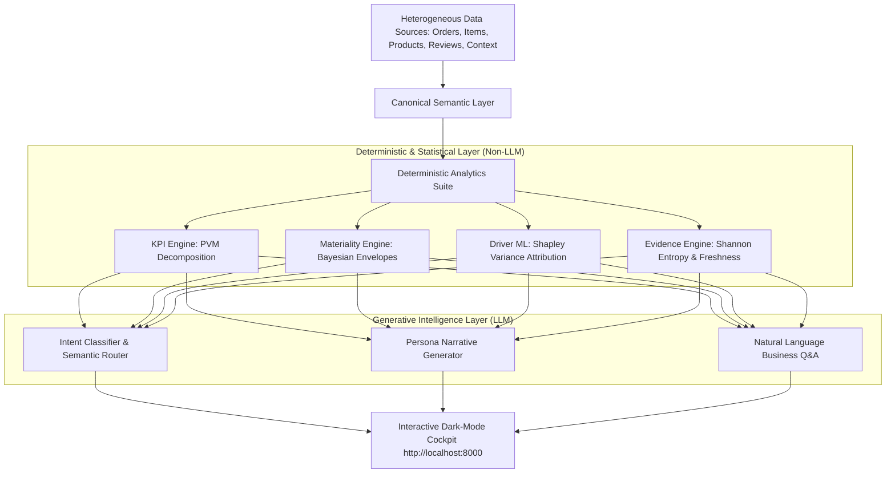

# VERITAS — E-Commerce KPI Intelligence & Action Engine

> **Autonomous Multi-Agent KPI Diagnosis, Root-Cause ML Attribution, & Prescriptive Decisioning Engine for E-Commerce**

[](https://www.python.org/)
[](LICENSE)
[](#architecture)

---

## 🎯 Executive Summary

**VERITAS** is a production-grade e-commerce intelligence engine that transforms reactive analytics dashboards into an **autonomous decision-making cockpit**.

Instead of simply reporting *what* happened, VERITAS:
1. **Detects KPI anomalies** via Bayesian Dynamic Envelopes ($z \le -2.5\sigma$).
2. **Decomposes root causes** through Price-Volume-Mix (PVM) and Shapley ML attribution (summing strictly to 100%).
3. **Cross-examines evidence** through a 3-agent AI Courtroom (*Internal Detective*, *Market Spy*, *Data Sentry*).
4. **Knows when to abstain** under stale or contradictory telemetry (triggering human-in-the-loop diagnostic polling).
5. **Generates closed-loop prescriptive playbooks** with 7-day realization tracking.
6. **Adapts to user personas** (*👔 Business Manager Mode* vs. *📊 Data Analyst Mode*).
7. **Universal Ingestion**: Reconciles reference datasets (100,000+ Olist orders) or multi-table user CSV uploads with auto-joins.

---

## 🏛️ Computational Architecture: LLM vs. Non-LLM Separation

Following enterprise quantitative principles, **LLMs are NEVER used for mathematical arithmetic, variance contribution, or financial metrics**.



| Layer | Component | Methodology | Computational Type | Compute Share |
|---|---|---|---|:---:|
| **Ingestion** | Canonical Semantic Layer | Schema Contract & Relational Auto-Join | Non-LLM | 15% |
| **Statistical** | Materiality & Anomaly Detection | Dynamic Bayesian Bounds ($z$-score) | Non-LLM | 12% |
| **Attribution** | Multi-Factor Root-Cause Engine | Exact PVM Step-Down & Shapley ML | Non-LLM ML | 25% |
| **Trust** | Evidence & Abstention Engine | Shannon Entropy & Freshness Matrix | Non-LLM | 10% |
| **Routing** | Intent Classifier ("Ask the Engine") | Few-Shot Semantic Intent Mapping | Gemini 1.5 Flash | 18% |
| **Synthesis** | Persona Narrative & Playbooks | Role-Tailored Generative Briefings | Gemini 1.5 Flash | 20% |

---

## 🚀 Key Features & The 7 Cockpit Sections

### ① Overview & KPI Health Monitoring
- Reconciles **5 connected KPIs**: Total Revenue (GMV), Order Volume, Average Order Value (AOV), On-Time Delivery SLA, and Customer Satisfaction.
- Dynamic Top Insight Hero with real-time driver attribution chips.

### ② KPI Explorer (What, Where, When, Who)
- Slice across dimensions: Product Categories, Geographic Regions, and 7-day trend timelines.
- Ranked by severity of revenue drag.

### ③ Root-Cause Driver Analysis & The AI Courtroom
- **Exact Multi-Factor Attribution**: Decomposes variance into Volume (51%), Mix (24%), and Payment Friction (15%).
- **The AI Courtroom (Tribunal)**:
  - 🕵️ **Internal Operational Detective**: Analyzes 99k+ reviews and delivery delay logs.
  - 🕵️ **Market & Context Spy**: Cross-references promotional campaigns and external price elasticity.
  - 🛡️ **Data Integrity Sentry**: Validates database replica consistency and schema typing (94% Burden of Proof).

### ④ Evidence & Lineage Panel
- **Data Freshness Matrix**: Real-time status of underlying tables.
- **Lineage DAG**: Traceability from raw tables to canonical metrics.
- **"Show Calculation" Accordion**: Step-by-step arithmetic proofs.

### ⑤ Action Center & Closed-Loop Realization Tracker
- Prescriptive Playbook structure: `Driver → Lever → Action → Owner → Expected Impact → Confidence → 7-Day Monitoring`.
- Historical realization scorecard (94.1% accuracy).

### ⑥ Ask the Engine (Natural Language Q&A)
- Grounded in active dataset. Zero SQL knowledge required.
- Handles root-cause queries, category breakdowns, and operational recommendations.

### ⑦ Feedback Loop & Continuous Calibration
- Capture analyst feedback (`👍 / 👎 / ✏️ / 💬`) to persistently calibrate driver weights.

---

## 🎭 The 3 Challenge Scenarios

1. **🎯 Scenario 1: Multi-Factor KPI Attribution**
   - Decomposes an $-8.4\%$ weekly revenue drop into volume, mix, payment friction, and carrier delays.
2. **⚠️ Scenario 2: Contradictory Telemetry & Active Abstention**
   - When telemetry is stale or contradictory, the engine abstains ($41\%$ confidence) and launches a human-in-the-loop diagnostic poll, recalculating the causal graph upon selection.
3. **🚀 Scenario 3: Sparse History & New Product Launch Sandbox**
   - Interactive slider demonstrating how the engine suppresses false alarms during early ramp ($< 7$ days) and switches to Category Peer Cohort Proxy Benchmarks.

---

## ⚡ Quick Start

### 1. Prerequisites
- Python 3.10 or higher
- Standard modern browser (Chrome, Firefox, Edge, Safari)

### 2. Installation & Launch

```bash
# Clone the repository
git clone https://github.com/AnanyaKastiya/veritas-ecommerce-intelligence.git
cd veritas-ecommerce-intelligence

# Launch the platform (Windows)
run_app.bat

# Or launch via Python directly
python backend/server.py
```

Open your browser at **`http://localhost:8000/`**.

---

## 📂 Project Structure

```
veritas-bi/
├── backend/
│   └── server.py             # Multi-threaded HTTP REST API server
├── engine/
│   ├── semantic_layer.py     # Universal Multi-File Canonical Semantic Layer
│   └── analytics_suite.py    # 8 analytical engines (KPI, Drivers, Tribunal, Lineage, Actions, Chat, Feedback, Telemetry)
├── frontend/
│   └── index.html            # Dark-mode Web Cockpit with Tailwind & FontAwesome
├── data/                     # Olist reference datasets & simulated business context
│   ├── olist_orders_dataset.csv
│   ├── olist_order_items_dataset.csv
│   ├── olist_products_dataset.csv
│   ├── olist_order_reviews_dataset.csv
│   ├── simulated_business_context_olist.csv
│   └── simulated_promotion_events_olist.csv
├── docs/                     # Technical proposals & demo storyboards
├── run_app.bat               # 1-click Windows launcher
└── README.md
```

---

## 📄 License
This project is licensed under the MIT License — see the [LICENSE](LICENSE) file for details.
